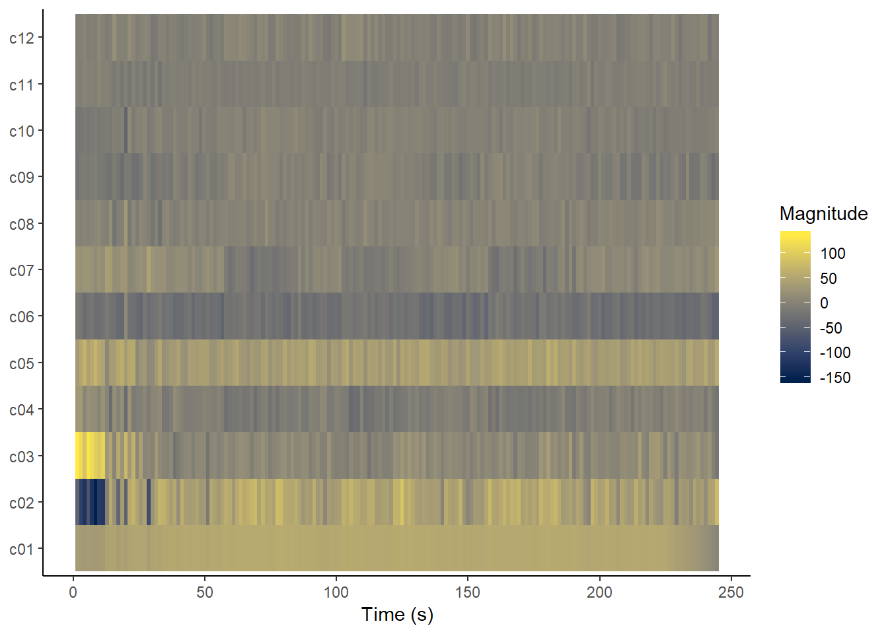
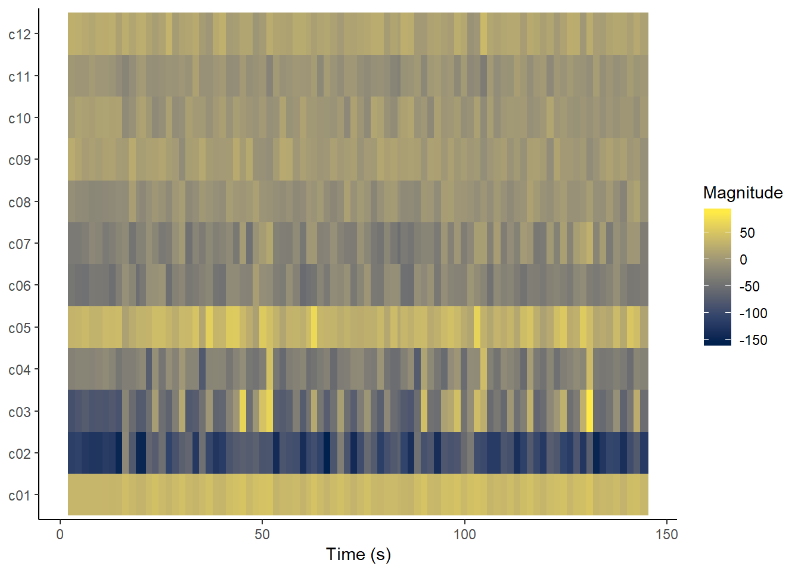
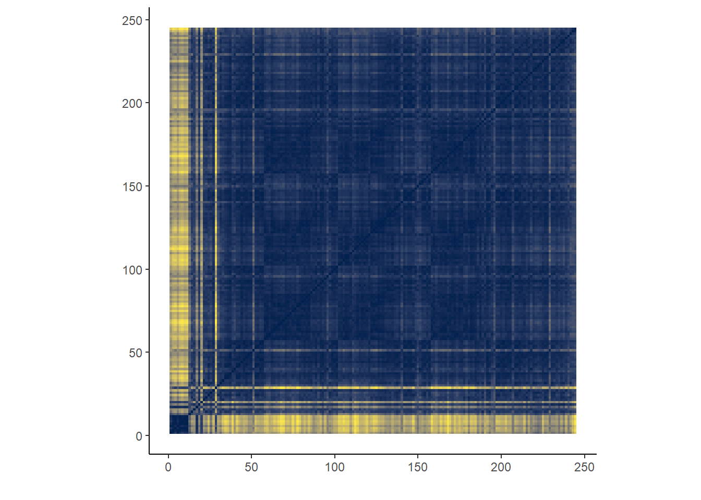
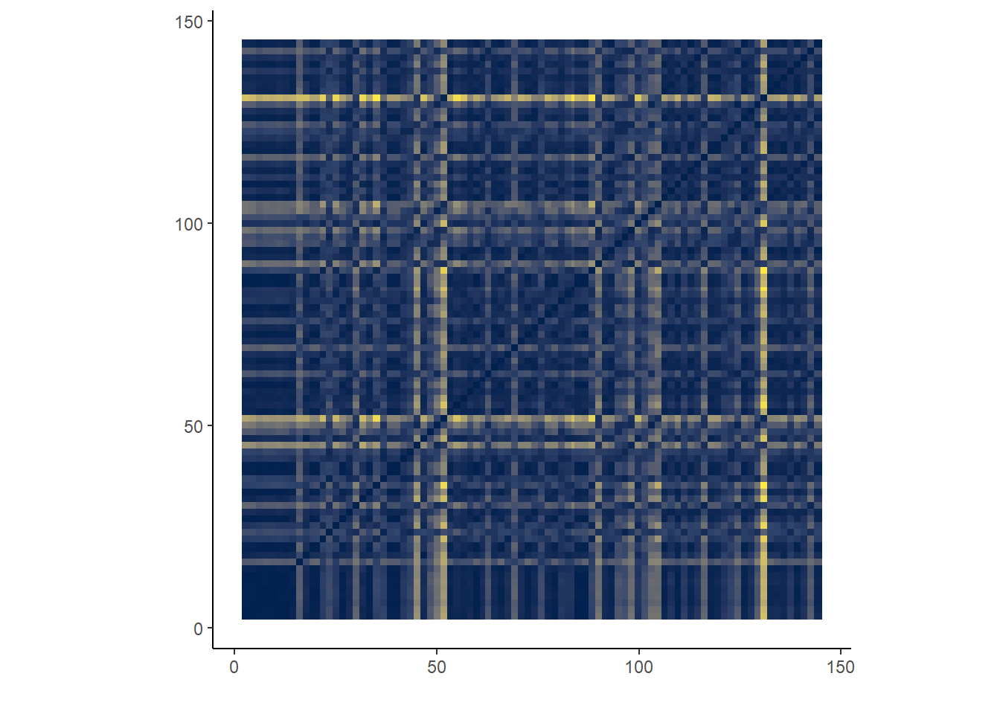

```{r}
library(tidyverse)
library(spotifyr)
library(flexdashboard)
library(plotly)
library(Cairo)
library(shiny)
library(dplyr)
library(knitr)
Sys.setenv(SPOTIFY_CLIENT_ID = '7695c57a82654e18ae7990e714b60c38')
Sys.setenv(SPOTIFY_CLIENT_SECRET = 'fac65dcc16154cbeb79e71ef5dbd9465')
load(file="BOTHPLAYLISTS.RData")
source('spotify (3).R')
load("~/CLC jaar 2/Computational Musicology/BKH/TOTALCOFFEEHOUSE.RData")
load("~/CLC jaar 2/Computational Musicology/BKH/TOTALONTHEROAD.RData")
library(compmus)
```

My Corpus {.tabset}
=================================================================

Row
----------------------------------------------------------------

### Introduction {data-width=300}
I am looking at Spotify's 'Coffeehouse' and 'On the Road' playlists. A coffeehouse is a pleasant place where you can talk, work or read while enjoying a cup of coffee; you will probably listen to easy, mellow songs here. But, when you're on the road, you have to kill time while going from A to B (whether you're alone or with friends; you go to work or are on a holiday). Since the car is a private place, you might listen to uplifting, sing-along songs. So, what are the characteristics of these playlists and in what ways do they differ? 

### Playlists {data-width=700}

I am using the following playlists for this research, composed by Spotify and Digster Nederland:

  **Coffeehouse:**
  
    1. Coffeehouse - Feel the vibe of the Coffeehouse playlist, full of relaxing singer-songwriter an pop music.    
    2. 't Koffiehuis - 'n Bakkie en gemoedelijke muziek op de achtergrond.    
    3. Your Favorite Coffeehouse - Curl up in your favorite spot with some sweet, mellow tunes...
  
 **On the Road:**
 
    1. Classic Road Trip Songs - The ultimate playlist to fuel your good mood while on the road.
    2. Onderweg - Met deze playlist heb je altijd de beste hits bij de hand voor onderweg.
    3. Road Trip - Go on a weekend getaway with your barkada and your favorite hits!
    
Row
---------------------------------------------------------------

### Data

This results in a total of 281 Coffeehouse songs and 168 On the Road songs.

```{r, echo=FALSE}
plot_mode_key <- ggplot(BOTHPLAYLISTS, aes(x=mode, fill=key)) + geom_bar() + facet_wrap(~playlist_name)

ggplotly(plot_mode_key, height = 400)
```

Findings {.tabset}
=================================================================

Text
-----------------------------------------------------------------
### Track popularity

The Coffeehouse playlists have a mean track popularity of 52.38 (SD = 25.751), whereas the On the Road playlists have a higher mean track popularity of 61.68 (SD = 29.766). This makes sense, since the On the Road playlists contain more songs that everyone can sing along to, and are thus familiar to a large audience. 

### Energy
I expect that energy of the On the Road playlists is much higher than for Coffehouse playlists. While on the road, you need to stay awake, so most songs have a loud beat. Coffeehouse songs, on the other hand, sound more quiet and peaceful. Spotify measured that the average energy in On the Road songs is 0.6131 (SD = 0.295) and 0.3596 (SD = 0.262) in Coffehouse songs. Indeed, energy seems to be much higher in On the Road playlists. 

### Acousticness

Characteristic for mellow Coffeehouse songs is their high acousticness (0.6589, SD = 0.347). The playlists contain mostly easy, soft songs that are accompanied by piano or guitar without much of electronic sounds. The acousticness of these playlists is thus, as expected, much higher than for On the Road playlists (0.2932, SD = 0.353). 

### Valence

I experience the On the Road playlists to be happier than Coffeehouse playlists, since these songs sound more uplifting to me. Spotify has generated a measure for valence: the higher the valence value, the happier the song. According to this measure, On the Road playlists are happier (0.4709, SD = 0.304) than Coffeehouse playlists (0.3555, SD = 0.3165).

Boxplots
----------------------------------------------------------------

```{r}
BoxplotTrackPopularity <- ggplot(BOTHPLAYLISTS, aes(x = playlist_name, y = track_popularity, fill = playlist_name)) + geom_boxplot() + scale_fill_manual(values = c("lightskyblue3", "steelblue4")) + theme(legend.position = "none", axis.title.x=element_blank(), axis.title.y = element_blank()) + ggtitle("Track Popularity")
```

```{r}
ggplotly(BoxplotTrackPopularity, echo = FALSE, width = 312.5)
```

```{r}
BoxplotEnergy <- ggplot(BOTHPLAYLISTS, aes(x = playlist_name, y = energy, fill = playlist_name)) + geom_boxplot() + scale_fill_manual(values = c("lightskyblue3", "steelblue4")) + theme(legend.position = "none", axis.title.x=element_blank(), axis.title.y = element_blank()) + ggtitle("Energy")
```

```{r}
ggplotly(BoxplotEnergy, echo = FALSE, width = 312.5)
```

```{r}
BoxplotAcousticness <- ggplot(BOTHPLAYLISTS, aes(x = playlist_name, y = acousticness, fill = playlist_name)) + geom_boxplot() + scale_fill_manual(values = c("lightskyblue3", "steelblue4")) + theme(legend.position = "none", axis.title.x=element_blank(), axis.title.y = element_blank()) + ggtitle("Acousticness")
```

```{r}
ggplotly(BoxplotAcousticness, echo = FALSE, width = 312.5)
```

```{r}
BoxplotValence <- ggplot(BOTHPLAYLISTS, aes(x = playlist_name, y = valence, fill = playlist_name)) + geom_boxplot() + scale_fill_manual(values = c("lightskyblue3", "steelblue4")) + theme(legend.position = "none", axis.title.x=element_blank(), axis.title.y = element_blank()) + ggtitle("Valence")
```

```{r}
ggplotly(BoxplotValence, echo = FALSE, width = 312.5)
```

Energy vs acousticness {.tabset}
=================================================================
So, high *energy* is characteristic for Road Trip songs, whereas high *acousticness* is characteristic for Coffeehouse songs. I decided to plot energy and acousticness for both playlists, to see a clear difference. These figures indeed show mostly high acoustiness and low energy in Coffeehouse, and high energy and low acousticness in On the Road. Valence is added to show that songs with high energy and low acoustiness are happiest. 

```{r}
plot_both_acousticenergy <-  ggplot(BOTHPLAYLISTS, aes(x=energy, y=acousticness, col=playlist_name)) + geom_point(alpha=0.7, size=4) + scale_color_manual(values = c("lightskyblue3", "steelblue4"))
```

```{r, echo=FALSE}
ggplotly(plot_both_acousticenergy, height = 375)
```

Chromagram {.tabset}
=================================================================
I created a chromagram for Walk of Life (Dire Strates), found in an On the Road playlist, and for Waiting Around (Aisha Badru), found in a Coffeehouse playlist. 

Walk of Life is a typical On the Road song: it seems to be the song with most energy (0.960) and has low acousticness (0.356). According to Spotify, it is one of the least popular songs (16 in a range from 12-100), although I think everone knows this song. 

On the other hand, Waiting Around is the song with highest acousticness (0.988), and low energy (0.1470). It is thus a good example of a Coffeehouse song. With a populariry value of 23, this song is even more popular than Walk of Life, but I doubt that more people know this song.

```{r}
get_tidy_audio_analysis <- function(track_uri, ...) 
{
    get_track_audio_analysis(track_uri, ...) %>% 
        list %>% transpose %>% as_tibble %>% 
        mutate_at(vars(meta, track), . %>% map(as_tibble)) %>% 
        unnest(meta, track) %>% 
        select(
            analyzer_version,
            duration,
            contains('fade'),
            ends_with('confidence'),
            bars:segments) %>% 
        mutate_at(
            vars(bars, beats, tatums, sections), 
            . %>% map(bind_rows)) %>% 
        mutate(
            segments =
                map(
                    segments,
                    . %>% 
                        transpose %>% as_tibble %>% 
                        unnest(.preserve = c(pitches, timbre)) %>% 
                        mutate(
                            pitches = 
                                map(
                                    pitches, 
                                    . %>% 
                                        flatten_dbl %>% 
                                        set_names(
                                            c( 
                                                'C', 'C#|Db', 'D', 'D#|Eb', 
                                                'E', 'F', 'F#|Gb', 'G',
                                                'G#|Ab', 'A', 'A#|Bb', 'B'))),
                            timbre = 
                                map(
                                    timbre,
                                    . %>% 
                                        flatten_dbl %>% 
                                        set_names(
                                            c(
                                                'c1', 'c2', 'c3', 'c4', 
                                                'c5', 'c6', 'c7', 'c8',
                                                'c9', 'c10', 'c11', 'c12'))))))
}
```


```{r}

compmus_normalise <- compmus_normalize <- function(v, method = "euclidean")
{
    ## Supported functions
    
    harmonic  <- function(v) v * sum(1 / abs(v))
    manhattan <- function(v) v / sum(abs(v))
    euclidean <- function(v) v / sqrt(sum(v^2))
    chebyshev <- function(v) v / max(abs(v))
    clr       <- function(v) {lv <- log(v); lv - mean(lv)}
    
    ## Method aliases
    
    METHODS <-
        list(
            harmonic  = harmonic,
            manhattan = manhattan,
            L1        = manhattan,
            euclidean = euclidean,
            L2        = euclidean,
            chebyshev = chebyshev,
            maximum   = chebyshev,
            aitchison = clr,
            clr       = clr)
    
    ## Function selection
    

    if (!is.na(i <- pmatch(method, names(METHODS))))
        METHODS[[i]](v)
    else 
        stop('The method name is ambiguous or the method is unsupported.')
}

compmus_long_distance <- function(xdat, ydat, feature, method = "euclidean")
{
    
    feature <- enquo(feature)
    
    ## Supported functions
    
    manhattan <- function(x, y) sum(abs(x - y))
    euclidean <- function(x, y) sqrt(sum((x - y) ^ 2))
    chebyshev <- function(x, y) max(abs(x - y))
    pearson   <- function(x, y) 1 - cor(x, y)
    cosine    <- function(x, y)
    {
        1 - sum(compmus_normalise(x, "euc") * compmus_normalise(y, "euc"))
    }
    angular   <- function(x, y) 2 * acos(1 - cosine(x, y)) / pi
    aitchison <- function(x, y)
    {
        euclidean(compmus_normalise(x, "clr"), compmus_normalise(y, "clr"))
    }
    
    ## Method aliases
    
    METHODS <-
        list(
            manhattan   = manhattan,
            cityblock   = manhattan,
            taxicab     = manhattan,
            L1          = manhattan,
            totvar      = manhattan,
            euclidean   = euclidean,
            L2          = euclidean,
            chebyshev   = chebyshev,
            maximum     = chebyshev,
            pearson     = pearson,
            correlation = pearson,
            cosine      = cosine,
            angular     = angular,
            aitchison   = aitchison)
    
    ## Function selection
    
    if (!is.na(i <- pmatch(method, names(METHODS))))
        bind_cols(
            crossing(
                xdat %>% select(xstart = start, xduration = duration),
                ydat %>% select(ystart = start, yduration = duration)),
            xdat %>% select(x = !!feature) %>% 
                crossing(ydat %>% select(y = !!feature)) %>% 
                transmute(d = map2_dbl(x, y, METHODS[[i]])))
    else 
        stop('The method name is ambiguous or the method is unsupported.')
}
```

```{r}

compmus_gather_chroma <- function(data)
{
    data %>% 
    mutate(pitches = map(pitches, bind_rows)) %>% unnest(pitches) %>% 
    gather("pitch_class", "value", C:B) %>% 
    mutate(pitch_class = fct_shift(factor(pitch_class), 3))
}
```

### Walk of Life

```{r}
WalkOfLife <- 
    get_tidy_audio_analysis('4xxB8QUtn8rF4Z2yaRICqp') %>% 
    select(segments) %>% unnest(segments) %>% 
    select(start, duration, pitches)
```

```{r, echo = FALSE}
WalkOfLife %>% 
    mutate(pitches = map(pitches, compmus_normalise, 'chebyshev')) %>% 
    compmus_gather_chroma %>% 
    ggplot(
        aes(
            x = start + duration / 2, 
            width = duration, 
            y = pitch_class, 
            fill = value)) + 
    geom_tile() +
    labs(x = 'Time (s)', y = NULL, fill = 'Magnitude') +
    theme_minimal()
```

### Waiting Around

```{r}
WaitingAround <- 
    get_tidy_audio_analysis('6WQlGuh6c4jciXEyM2rVGX') %>% 
    select(segments) %>% unnest(segments) %>% 
    select(start, duration, pitches)
```

```{r, echo = FALSE}
WaitingAround %>% 
    mutate(pitches = map(pitches, compmus_normalise, 'chebyshev')) %>% 
    compmus_gather_chroma %>% 
    ggplot(
        aes(
            x = start + duration / 2, 
            width = duration, 
            y = pitch_class, 
            fill = value)) + 
    geom_tile() +
    labs(x = 'Time (s)', y = NULL, fill = 'Magnitude') +
    theme_minimal()
```

Self-Similarity Matrix {.tabset}
==================================================================

Cepstograms {data-width = 500}
-----------------------------------------------------------------

 


SSMs {data-width = 500}
------------------------------------------------------------------




Conclusion {.tabset}
==================================================================
